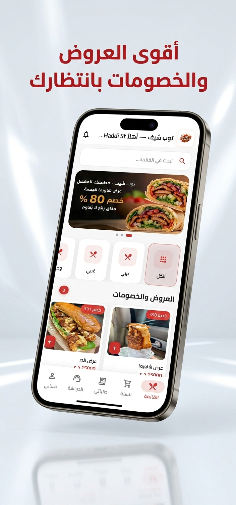
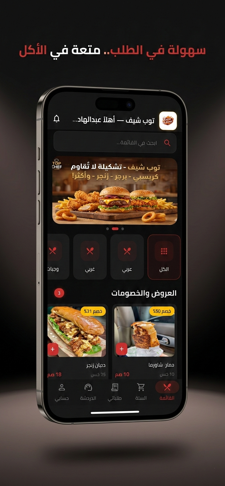
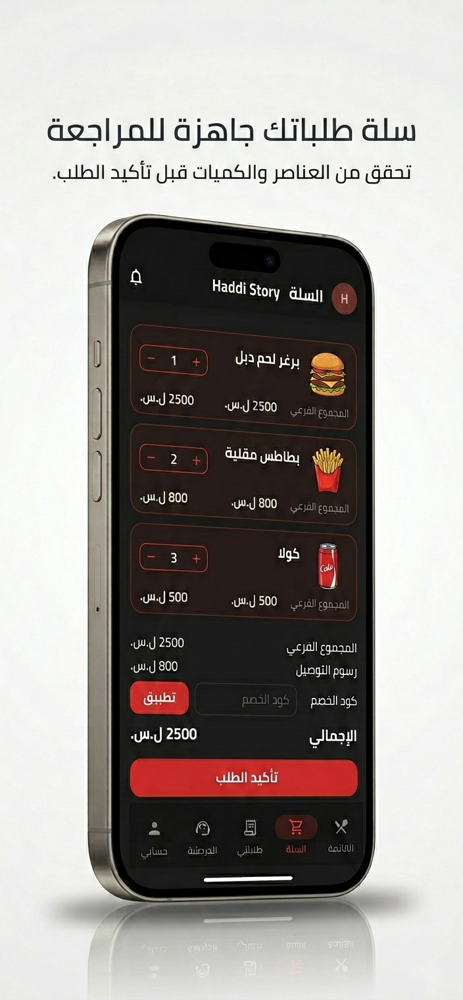
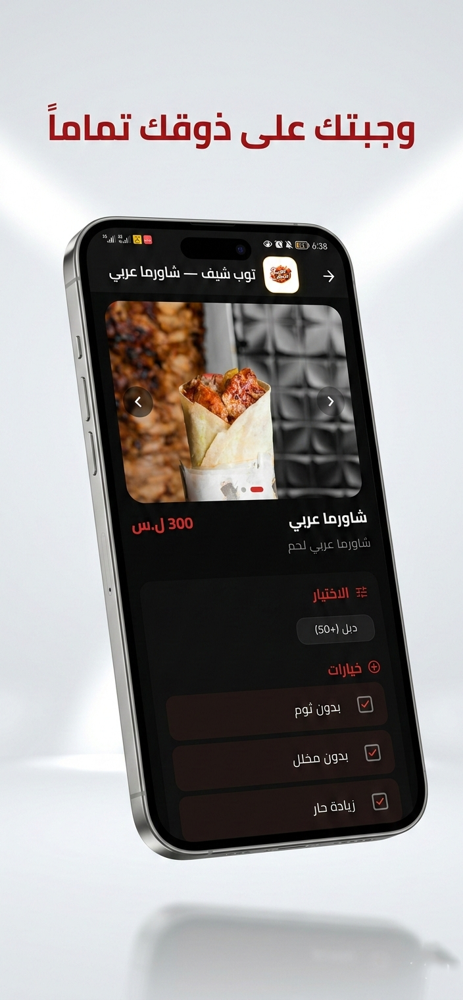
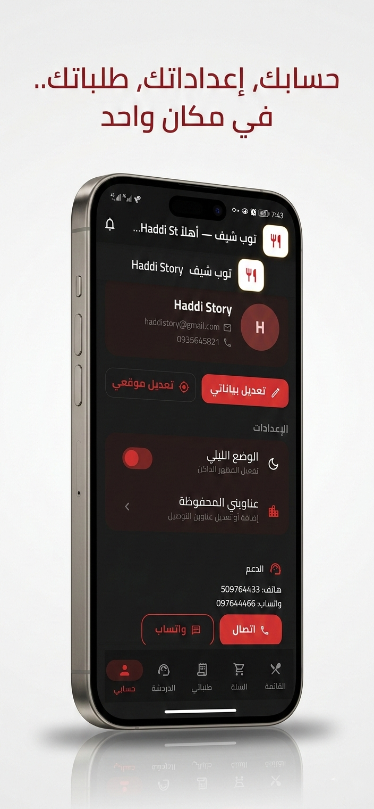
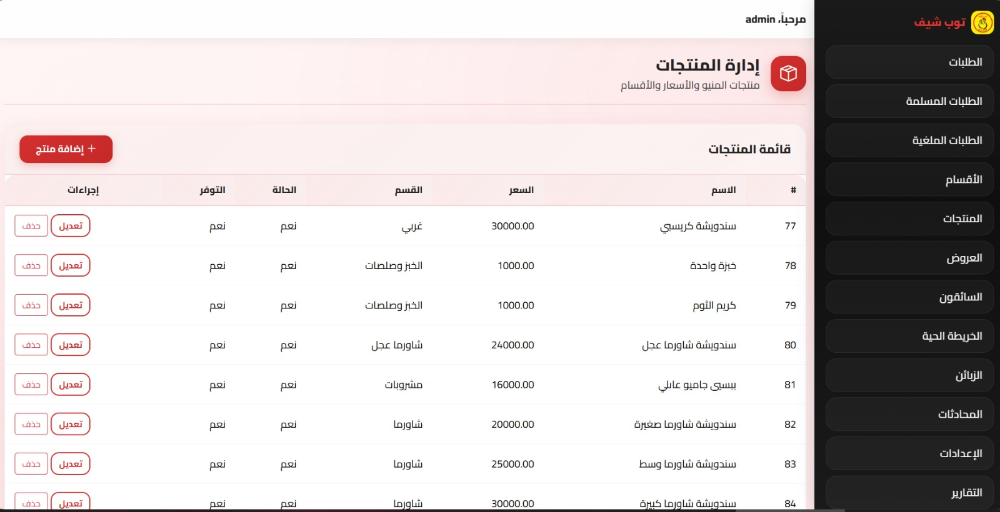
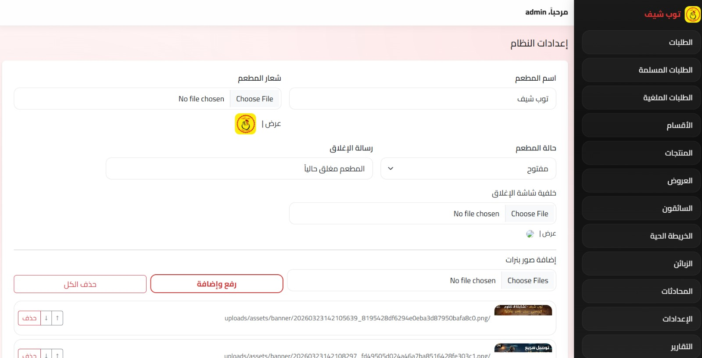
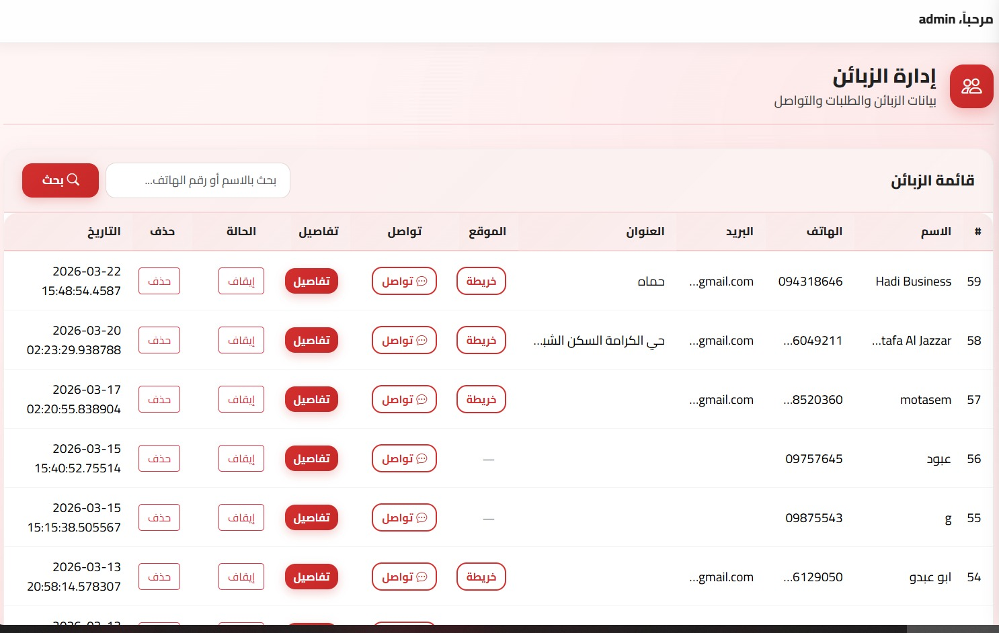
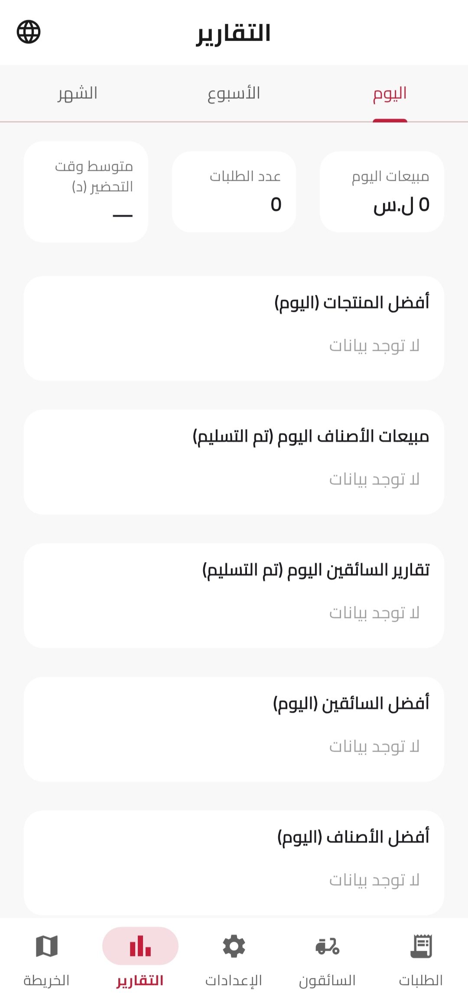

<div align="center">

# 🍗 Top Chef — Smart Restaurant Delivery System
### نظام إدارة وتوصيل طلبات المطعم الذكي

[](https://flutter.dev)
[](https://dotnet.microsoft.com)
[](https://mysql.com)
[](https://firebase.google.com)
[](https://docker.com)

---

*A full-stack, production-ready restaurant management and food delivery platform — built with Flutter, ASP.NET Core, MySQL & Firebase.*

*منصة متكاملة لإدارة المطعم والتوصيل — مبنية بأحدث التقنيات*

</div>

---

## 📋 Table of Contents / فهرس المحتويات

- [Overview](#-overview--نظرة-عامة)
- [System Architecture](#-system-architecture--البنية-التقنية)
- [Screenshots](#-screenshots--لقطات-الشاشة)
- [Tech Stack](#-tech-stack--التقنيات-المستخدمة)
- [Features by Module](#-features-by-module--ميزات-كل-وحدة)
- [Project Structure](#-project-structure--هيكل-المشروع)
- [How It Works](#-how-it-works--آلية-العمل)
- [Advanced Technical Features](#-advanced-technical-features--الميزات-التقنية-المتقدمة)

---

## 🌟 Overview / نظرة عامة

**Top Chef** is a fully integrated digital system designed to manage all aspects of a restaurant's operations — from order placement to real-time delivery tracking. The platform consists of **four interconnected modules**, all powered by a central RESTful API.

**توب شيف** هو نظام رقمي متكامل يغطي جميع عمليات المطعم — من استقبال الطلبات إلى تتبع التوصيل اللحظي. يتكون النظام من **أربع وحدات مترابطة** تعمل عبر API مركزي موحد.

| Module | Technology | Description |
|--------|-----------|-------------|
| 📱 Customer App | Flutter / Android | Order, track, chat with support |
| 🚗 Driver App | Flutter / Android | Receive & deliver orders with GPS |
| 🧑‍💼 Admin App | Flutter / Android | Monitor & manage in real-time |
| 🌐 Web Dashboard | ASP.NET Core | Full restaurant control panel |

---

## 🏗️ System Architecture / البنية التقنية

```
┌─────────────────────────────────────────────────────────┐
│                   CLIENT LAYER                          │
│  ┌─────────────┐  ┌─────────────┐  ┌─────────────┐    │
│  │ Customer App│  │  Driver App │  │  Admin App  │    │
│  │  (Flutter)  │  │  (Flutter)  │  │  (Flutter)  │    │
│  └──────┬──────┘  └──────┬──────┘  └──────┬──────┘    │
└─────────┼────────────────┼────────────────┼────────────┘
          │                │                │
          ▼                ▼                ▼
┌─────────────────────────────────────────────────────────┐
│              API + DASHBOARD LAYER                      │
│         ASP.NET Core — RESTful API + Web UI             │
│         JWT Auth · SignalR Hubs · FCM Service           │
└─────────────────────┬───────────────────────────────────┘
                      │
          ┌───────────┼───────────┐
          ▼           ▼           ▼
     ┌─────────┐ ┌─────────┐ ┌─────────┐
     │  MySQL  │ │Firebase │ │SignalR  │
     │   DB    │ │Auth+FCM │ │Real-Time│
     └─────────┘ └─────────┘ └─────────┘
```

---

## 📸

<table>
<tr>
<td align="center"><br/><b>Account Management</b><br/>إدارة حسابك</td>
<td align="center"><br/><b>Order Review</b><br/>مراجعة الطلب</td>
<td align="center"><br/><b>Product Details</b><br/>تفاصيل المنتج</td>
</tr>
<tr>
<td align="center"><br/><b>Offers & Deals</b><br/>العروض والخصومات</td>
<td align="center"><br/><b>Easy Ordering</b><br/>الطلب السهل</td>
<td></td>
</tr>
</table>

### 🌐 Web Dashboard — لوحة التحكم

<table>
<tr>
<td align="center"><br/><b>Products Management</b><br/>إدارة المنتجات</td>
<td align="center"><br/><b>System Settings</b><br/>إعدادات النظام</td>
</tr>
<tr>
<td align="center" colspan="2"><br/><b>Customers Management</b><br/>إدارة الزبائن</td>
          <td align="center"><br/><b>Reports</b><br/>التقارير</td>
</tr>
</table>

---

## ⚙️ Tech Stack / التقنيات المستخدمة

### 📱 Mobile Apps
| Technology | Purpose |
|-----------|---------|
| **Flutter** (Dart) | Cross-platform mobile development |
| **Firebase Authentication** | User login & identity management |
| **Firebase Cloud Messaging (FCM)** | Push notifications (foreground + background) |
| **Google Maps API** | Location picking & route display |
| **SignalR Client** | Real-time order & GPS updates |
| **Foreground Service** | Continuous GPS tracking in Driver App |

### 🌐 Backend & Dashboard
| Technology | Purpose |
|-----------|---------|
| **ASP.NET Core** | Web API + Razor Pages Dashboard |
| **Entity Framework Core** | ORM & database migrations |
| **SignalR Hubs** | Real-time WebSocket communication |
| **JWT Authentication** | Secure API access for drivers |
| **Firebase Admin SDK** | Server-side FCM push notifications |
| **Docker + Docker Compose** | Containerized deployment |

### 🗄️ Database
| Technology | Purpose |
|-----------|---------|
| **MySQL 8** | Primary relational database |
| **EF Core Migrations** | Schema version control |
| **Transactions** | Data consistency & integrity |

---

## 🔧 Features by Module / ميزات كل وحدة

### 👤 Customer App

| Feature | Details |
|---------|---------|
| 🔐 Authentication | Firebase Auth — email/password + Google Sign-In |
| 🍽️ Menu Browsing | Categories, product images, prices, descriptions |
| 🛒 Smart Cart | Add items, add per-product notes |
| 💰 Delivery Pricing | Auto-calculated per km (rate set by admin) |
| ⏱️ Order Lock | Modify or cancel within 1 minute only — server-enforced |
| 📍 Live Tracking | Real-time order status + driver GPS on map |
| 💬 In-App Chat | Direct messaging with restaurant admin |
| ⭐ Rating System | Rate order and driver (stars + comment) |
| 🔔 Push Notifications | Order updates, promotions, admin messages |
| 🌙 Dark Mode | Manual toggle or follows system setting |
| 🏠 Saved Addresses | Multiple delivery addresses per account |

### 🚗 Driver App

| Feature | Details |
|---------|---------|
| 🔐 Secure Login | Account created by admin only — no self-registration |
| 📲 Instant Alerts | FCM push notification on new order assignment |
| 📦 Order Details | Customer info, address, phone, total, items |
| 🔄 Order Lifecycle | Accept → Start Delivery → Confirm Delivery |
| 📡 Live GPS | Location broadcast every few seconds via foreground service |
| 📊 Daily Stats | Active orders, delivered orders, daily revenue |
| ⭐ Rating Display | Average rating shown on home screen |
| 🌙 Dark Mode | Optimized for night driving |

### 🧑‍💼 Admin App

| Feature | Details |
|---------|---------|
| 🔑 Admin Key Auth | Separate secure login for admin access |
| 📋 Live Orders | Real-time order list with status updates |
| 🚗 Driver Assignment | Assign one or multiple orders to a driver |
| ⏰ Time Control | Set prep & delivery time per order |
| 🗺️ Driver Map | Track all active drivers in real time |
| 💬 Chat Monitor | View and respond to customer chats |
| 📣 Broadcast | Push notifications to all customers |
| 📊 Quick Reports | Daily performance overview |

### 🌐 Web Dashboard

#### 🍔 Products & Menu
- Add / edit / delete products with image upload
- Category management
- Create promotions and discount offers with expiry dates

#### 🚚 Order Management
- View all orders with filtering (today / this week / this month)
- Assign drivers, set prep & delivery time estimates
- Customer receives instant notification on every update

#### 👥 Driver Management
- Create driver accounts with custom credentials
- Edit driver data and contact info
- Enable / disable accounts

#### 📍 Live Map
- Real-time map showing all active drivers
- Active order tracking overlay

#### 📊 Reports & Analytics
- **Orders:** total sales, order count, average order value
- **Drivers:** orders per driver, revenue, top performer (daily/weekly/monthly)
- **Products:** best-selling items, least ordered, category breakdown
- **Ratings:** average customer satisfaction scores

#### 🖨️ Smart Printing System
- Auto-print on every new order
- Route to different printers by product category:
  - Arabic kitchen items → Arabic kitchen printer
  - Western items → Western kitchen printer
  - Drinks → Bar printer
- Print daily / weekly / monthly reports

#### 🎨 Visual Identity Customization
- Change app logo from dashboard — reflects across all apps instantly
- Change app color theme — synced via API on app launch
- Modify general restaurant settings (name, delivery price, open/close status)

---

## 📁 Project Structure / هيكل المشروع

```
topchef/
├── AdminDashboard/                  # ASP.NET Core — Backend + Web Dashboard
│   ├── Controllers/                 # REST API Controllers
│   │   ├── CustomerController.cs    # Customer endpoints
│   │   ├── DriverController.cs      # Driver endpoints
│   │   ├── AdminController.cs       # Admin management endpoints
│   │   ├── PublicController.cs      # Public menu & settings API
│   │   ├── FcmController.cs         # Push notification endpoints
│   │   ├── RatingsController.cs     # Ratings & feedback
│   │   └── NotificationsController.cs
│   │
│   ├── Entities/                    # Database Models
│   │   ├── Orders.cs
│   │   ├── Customer.cs
│   │   ├── Driver.cs
│   │   ├── Menu.cs
│   │   ├── Promotions.cs
│   │   ├── TrackingAndFeedback.cs
│   │   ├── RestaurantSettings.cs
│   │   ├── DriverTrackPoint.cs
│   │   └── Notifications.cs
│   │
│   ├── Hubs/                        # SignalR Real-Time Hubs
│   │   ├── TrackingHub.cs           # Live GPS tracking
│   │   └── NotifyHub.cs             # Order status notifications
│   │
│   ├── Services/
│   │   ├── FcmService.cs            # Firebase push notifications
│   │   └── FirebaseAdminService.cs
│   │
│   ├── Security/                    # Authentication & Authorization
│   │   ├── DriverAuth.cs
│   │   ├── AdminApiKeyAttribute.cs
│   │   ├── AdminApiKeyAuthorizationHandler.cs
│   │   └── AdminPassword.cs
│   │
│   ├── Pages/Admin/                 # Razor Pages — Dashboard UI
│   │   ├── Orders.cshtml
│   │   ├── Products.cshtml
│   │   ├── Drivers.cshtml
│   │   ├── LiveMap.cshtml
│   │   ├── Reports.cshtml
│   │   ├── Customers.cshtml
│   │   ├── Settings.cshtml
│   │   ├── Offers.cshtml
│   │   ├── Discounts.cshtml
│   │   ├── Ratings.cshtml
│   │   └── Chats.cshtml
│   │
│   ├── Data/
│   │   ├── AppDbContext.cs
│   │   ├── DbSeeder.cs
│   │   └── NotificationService.cs
│   │
│   ├── Migrations/                  # EF Core DB Migrations
│   ├── Dockerfile
│   └── docker-compose.yml
│
└── apps/
    ├── customer_app/                # Flutter — Customer Mobile App
    │   └── lib/
    │       ├── screens/             # home, cart, orders, chat, profile...
    │       ├── services/            # API, push, realtime, firebase
    │       ├── widgets/             # Premium UI components
    │       └── theme/               # Dynamic theme from API
    │
    ├── driver_app/                  # Flutter — Driver Mobile App
    │   └── lib/
    │       ├── screens/             # Order detail, home, login
    │       └── services/            # GPS foreground service, location sender
    │
    └── admin_app/                   # Flutter — Admin Mobile App
        └── lib/
            ├── screens/             # Orders, map, reports, settings
            └── services/            # Admin API, auth storage
```

---

## 🔄 How It Works / آلية العمل

```
 1. Customer places an order
        ↓
 2. 1-minute window to modify or cancel (server-enforced)
        ↓
 3. Order appears in admin panel (real-time)
        ↓
 4. Admin sets prep time → Customer gets push notification
        ↓
 5. Order marked ready → Admin assigns a driver
        ↓
 6. Driver receives push notification instantly
        ↓
 7. Driver starts delivery → GPS broadcasting begins
        ↓
 8. Customer sees driver live on map
        ↓
 9. Driver confirms delivery → Order marked complete
        ↓
10. Customer rates order & driver
        ↓
11. Data feeds into analytics & reports
```

---

## 🚀 Advanced Technical Features / الميزات التقنية المتقدمة

| Feature | Implementation |
|---------|---------------|
| **Real-Time GPS Tracking** | Flutter foreground service → broadcasts to SignalR Hub → all connected clients updated instantly |
| **1-Minute Order Lock** | Server-side timestamp check on every modify/cancel request — cannot be bypassed by the client |
| **Dynamic Delivery Pricing** | `distance (km) × price_per_km` — rate configured by admin in dashboard |
| **Multi-Kitchen Printing** | Product category → printer routing logic in backend |
| **Dual Rating System** | Separate ratings for order quality and driver performance |
| **Visual Customization API** | Logo + color theme stored in DB — apps fetch on launch, changes reflect instantly |
| **Multi-Level Auth** | Firebase Auth (customers) · JWT Bearer (drivers API) · AdminKey (admin app) |
| **Docker Deployment** | Full containerized backend with `docker-compose.yml` |
| **Brand-Aware Apps** | Apps fetch branding from API on startup — one backend can serve multiple brands |
| **SignalR Hubs** | `TrackingHub` for GPS · `NotifyHub` for order events |

---

<div align="center">

**Built with Flutter · ASP.NET Core · MySQL · Firebase**

</div>
